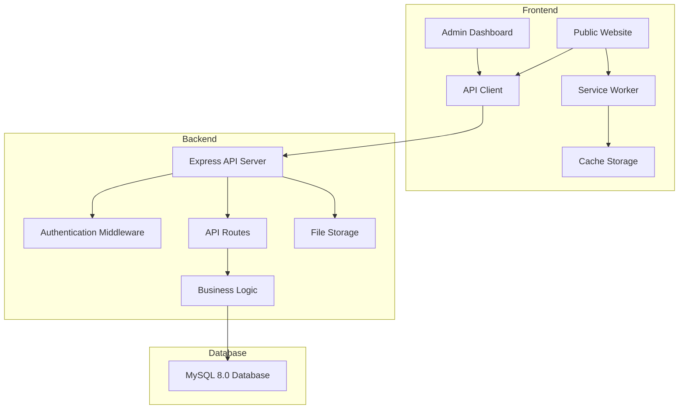

# Design Document: DB GENERAL CONSTRUCTION PWA

## Overview

The DB GENERAL CONSTRUCTION Progressive Web Application is a modern, performant website that showcases the company's construction services, portfolio, and contact information, integrated with a comprehensive admin dashboard for content management. The application will be built using HTML5, CSS3, and vanilla JavaScript for the frontend, with Node.js and Express for the backend API, and MongoDB for data persistence. The architecture emphasizes simplicity, maintainability, security, and adherence to PWA best practices.

## Architecture

### High-Level Architecture

The application follows a full-stack architecture with the following layers:

**Frontend (Public Website & Admin Dashboard)**
1. **Presentation Layer**: HTML templates with semantic markup and responsive CSS
2. **Service Worker Layer**: Handles caching strategies, offline functionality, and background sync
3. **Application Layer**: JavaScript modules for UI interactions, form handling, navigation, and admin operations
4. **API Client Layer**: Handles HTTP requests to backend API endpoints

**Backend (API Server)**
1. **API Layer**: RESTful endpoints for CRUD operations
2. **Authentication Layer**: JWT-based authentication and session management
3. **Business Logic Layer**: Data validation, processing, and business rules
4. **Data Access Layer**: Database operations and queries
5. **Storage Layer**: File system for image uploads

**Database**
1. **MySQL 8.0**: Relational database for storing projects, services, company info, and inquiries

### Technology Stack

**Frontend**
- **HTML5**: Semantic markup for accessibility and SEO
- **CSS3**: Modern styling with CSS Grid, Flexbox, and CSS Custom Properties
- **Vanilla JavaScript (ES6+)**: Modular code without framework dependencies
- **Service Worker API**: For offline functionality and caching
- **Web App Manifest**: For PWA installation capabilities
- **Fetch API**: For HTTP requests to backend

**Backend**
- **Node.js**: JavaScript runtime for server-side code
- **Express.js**: Web framework for API routes and middleware
- **MySQL 8.0**: Relational database for content storage
- **mysql2**: MySQL client for Node.js with Promise support
- **Sequelize**: ORM for MySQL data modeling and migrations
- **JWT (jsonwebtoken)**: For authentication tokens
- **bcrypt**: For password hashing
- **Multer**: For handling file uploads
- **express-validator**: For request validation

### Architecture Diagram



## Components and Interfaces

### 1. Page Structure Components

#### Header Component
- **Responsibility**: Display company branding and navigation
- **Elements**: Logo, company name, navigation menu, mobile menu toggle
- **Interface**: Responsive navigation that collapses on mobile devices

#### Hero Section Component
- **Responsibility**: Create visual impact and call-to-action
- **Elements**: Background image, headline, tagline, CTA button
- **Interface**: Full-width section with optimized images

#### Services Section Component
- **Responsibility**: Display construction services offered
- **Elements**: Service cards with icons, titles, and descriptions
- **Interface**: Grid layout that adapts to screen size

#### Portfolio Section Component
- **Responsibility**: Showcase completed projects
- **Elements**: Project cards with images, titles, descriptions, and detail views
- **Interface**: Gallery grid with modal/detail view for individual projects

#### About Section Component
- **Responsibility**: Present company information
- **Elements**: Company history, mission, team information
- **Interface**: Text content with supporting images

#### Contact Section Component
- **Responsibility**: Enable user inquiries
- **Elements**: Contact form, company contact details, map (optional)
- **Interface**: Form with validation and submission handling

#### Footer Component
- **Responsibility**: Display secondary information and links
- **Elements**: Copyright, social media links, additional navigation
- **Interface**: Multi-column layout on desktop, stacked on mobile

### 2. Service Worker Component

#### Caching Strategy
- **Cache First**: For static assets (CSS, JS, images, fonts)
- **Network First**: For HTML pages (with cache fallback)
- **Network Only**: For form submissions

#### Offline Fallback
- Serve cached pages when offline
- Display offline indicator when network is unavailable

### 3. Form Handler Component

#### Contact Form Module
- **Responsibility**: Handle form validation and submission
- **Methods**:
  - `validateField(field)`: Validate individual form field
  - `validateForm()`: Validate entire form before submission
  - `submitForm(data)`: Submit form data to endpoint
  - `displaySuccess()`: Show success message
  - `displayError(message)`: Show error message

### 4. Navigation Component

#### Navigation Module
- **Responsibility**: Handle smooth scrolling and active state
- **Methods**:
  - `scrollToSection(sectionId)`: Smooth scroll to section
  - `updateActiveLink()`: Highlight current section in navigation
  - `toggleMobileMenu()`: Show/hide mobile navigation

### 5. Image Optimization Component

#### Lazy Loading Module
- **Responsibility**: Defer loading of below-the-fold images
- **Implementation**: Intersection Observer API
- **Methods**:
  - `observeImages()`: Set up lazy loading for images
  - `loadImage(img)`: Load image when in viewport

### 6. Admin Dashboard Components

#### Admin Login Component
- **Responsibility**: Authenticate administrators
- **Elements**: Login form with email and password fields
- **Interface**: Centered login card with validation
- **Methods**:
  - `validateCredentials()`: Validate login form
  - `login(credentials)`: Send login request to API
  - `storeToken(token)`: Store JWT token in localStorage
  - `redirectToDashboard()`: Navigate to admin dashboard

#### Admin Navigation Component
- **Responsibility**: Provide navigation within admin dashboard
- **Elements**: Sidebar menu with links to all admin sections, logout button
- **Interface**: Collapsible sidebar on mobile, fixed on desktop
- **Methods**:
  - `toggleSidebar()`: Show/hide mobile sidebar
  - `highlightActiveSection()`: Mark current section as active
  - `logout()`: Clear session and redirect to login

#### Projects Management Component
- **Responsibility**: CRUD operations for portfolio projects
- **Elements**: Projects list table, add/edit project form, delete confirmation modal
- **Interface**: Data table with action buttons, modal forms
- **Methods**:
  - `fetchProjects()`: Get all projects from API
  - `renderProjectsList()`: Display projects in table
  - `showAddProjectForm()`: Display empty project form
  - `showEditProjectForm(projectId)`: Display form with project data
  - `saveProject(projectData)`: Create or update project via API
  - `deleteProject(projectId)`: Delete project with confirmation
  - `uploadProjectImages(files)`: Upload images for project

#### Services Management Component
- **Responsibility**: CRUD operations for services
- **Elements**: Services list, add/edit service form, delete confirmation
- **Interface**: Card grid or table with action buttons
- **Methods**:
  - `fetchServices()`: Get all services from API
  - `renderServicesList()`: Display services
  - `showAddServiceForm()`: Display empty service form
  - `showEditServiceForm(serviceId)`: Display form with service data
  - `saveService(serviceData)`: Create or update service via API
  - `deleteService(serviceId)`: Delete service with confirmation

#### Company Info Management Component
- **Responsibility**: Update company information
- **Elements**: Form with fields for all company details
- **Interface**: Single-page form with sections
- **Methods**:
  - `fetchCompanyInfo()`: Get current company info from API
  - `renderCompanyInfoForm()`: Display form with current data
  - `updateCompanyInfo(data)`: Save updated company info via API

#### Inquiries Management Component
- **Responsibility**: View and manage contact form submissions
- **Elements**: Inquiries list table, inquiry detail view, status filters
- **Interface**: Table with filtering, modal for full inquiry details
- **Methods**:
  - `fetchInquiries(filter)`: Get inquiries from API with optional filter
  - `renderInquiriesList()`: Display inquiries in table
  - `showInquiryDetails(inquiryId)`: Display full inquiry in modal
  - `markAsRead(inquiryId)`: Update inquiry status to read
  - `markAsResolved(inquiryId)`: Update inquiry status to resolved
  - `deleteInquiry(inquiryId)`: Delete inquiry with confirmation
  - `getUnreadCount()`: Get count of unread inquiries for badge

#### Media Library Component
- **Responsibility**: Manage uploaded images
- **Elements**: Image grid, upload button, image details modal
- **Interface**: Grid gallery with upload area
- **Methods**:
  - `fetchImages()`: Get all images from API
  - `renderImageGrid()`: Display images in grid
  - `uploadImage(file)`: Upload new image via API
  - `showImageDetails(imageId)`: Display image info in modal
  - `deleteImage(imageId)`: Delete image with confirmation and usage check
  - `copyImageUrl(imageId)`: Copy image URL to clipboard

### 7. API Client Component

#### API Service Module
- **Responsibility**: Handle all HTTP requests to backend API
- **Base URL**: Configurable API endpoint
- **Methods**:
  - `get(endpoint)`: GET request with auth token
  - `post(endpoint, data)`: POST request with auth token
  - `put(endpoint, data)`: PUT request with auth token
  - `delete(endpoint)`: DELETE request with auth token
  - `upload(endpoint, formData)`: POST request for file uploads
  - `handleResponse(response)`: Process API responses
  - `handleError(error)`: Process API errors
  - `getAuthToken()`: Retrieve JWT token from storage
  - `setAuthToken(token)`: Store JWT token
  - `clearAuthToken()`: Remove JWT token on logout

### 8. Backend API Components

#### Authentication Controller
- **Responsibility**: Handle authentication logic
- **Endpoints**:
  - `POST /api/auth/login`: Authenticate user and return JWT
  - `POST /api/auth/logout`: Invalidate session
  - `GET /api/auth/verify`: Verify JWT token validity
- **Methods**:
  - `login(req, res)`: Validate credentials and generate JWT
  - `logout(req, res)`: Clear session
  - `verifyToken(req, res)`: Validate JWT token

#### Projects Controller
- **Responsibility**: Handle project CRUD operations
- **Endpoints**:
  - `GET /api/projects`: Get all projects
  - `GET /api/projects/:id`: Get single project
  - `POST /api/projects`: Create new project
  - `PUT /api/projects/:id`: Update project
  - `DELETE /api/projects/:id`: Delete project
- **Methods**:
  - `getAllProjects(req, res)`: Return all projects
  - `getProjectById(req, res)`: Return single project
  - `createProject(req, res)`: Validate and create project
  - `updateProject(req, res)`: Validate and update project
  - `deleteProject(req, res)`: Delete project

#### Services Controller
- **Responsibility**: Handle service CRUD operations
- **Endpoints**:
  - `GET /api/services`: Get all services
  - `GET /api/services/:id`: Get single service
  - `POST /api/services`: Create new service
  - `PUT /api/services/:id`: Update service
  - `DELETE /api/services/:id`: Delete service

#### Company Info Controller
- **Responsibility**: Handle company information operations
- **Endpoints**:
  - `GET /api/company`: Get company information
  - `PUT /api/company`: Update company information

#### Inquiries Controller
- **Responsibility**: Handle inquiry operations
- **Endpoints**:
  - `GET /api/inquiries`: Get all inquiries with optional filters
  - `GET /api/inquiries/:id`: Get single inquiry
  - `POST /api/inquiries`: Create new inquiry (public endpoint)
  - `PUT /api/inquiries/:id/status`: Update inquiry status
  - `DELETE /api/inquiries/:id`: Delete inquiry
  - `GET /api/inquiries/unread/count`: Get unread count

#### Media Controller
- **Responsibility**: Handle image upload and management
- **Endpoints**:
  - `GET /api/media`: Get all images
  - `GET /api/media/:id`: Get single image details
  - `POST /api/media/upload`: Upload new image
  - `DELETE /api/media/:id`: Delete image
- **Methods**:
  - `getAllImages(req, res)`: Return all images
  - `getImageById(req, res)`: Return single image details
  - `uploadImage(req, res)`: Handle file upload with validation
  - `deleteImage(req, res)`: Delete image file and database record

#### Authentication Middleware
- **Responsibility**: Protect admin routes
- **Methods**:
  - `verifyToken(req, res, next)`: Verify JWT token in request headers
  - `requireAuth(req, res, next)`: Ensure user is authenticated

## Data Models

### Project Model (MySQL/Sequelize Schema)

```javascript
// Sequelize Model
{
  id: {
    type: DataTypes.INTEGER,
    primaryKey: true,
    autoIncrement: true
  },
  title: {
    type: DataTypes.STRING(255),
    allowNull: false
  },
  description: {
    type: DataTypes.TEXT,
    allowNull: false
  },
  category: {
    type: DataTypes.STRING(100),
    allowNull: false
  },
  completionDate: {
    type: DataTypes.DATE,
    allowNull: false
  },
  location: {
    type: DataTypes.STRING(255),
    allowNull: false
  },
  createdAt: {
    type: DataTypes.DATE,
    defaultValue: DataTypes.NOW
  },
  updatedAt: {
    type: DataTypes.DATE,
    defaultValue: DataTypes.NOW
  }
}

// Related table: project_images
{
  id: {
    type: DataTypes.INTEGER,
    primaryKey: true,
    autoIncrement: true
  },
  projectId: {
    type: DataTypes.INTEGER,
    allowNull: false,
    references: {
      model: 'projects',
      key: 'id'
    },
    onDelete: 'CASCADE'
  },
  src: {
    type: DataTypes.STRING(500),
    allowNull: false
  },
  alt: {
    type: DataTypes.STRING(255),
    allowNull: true
  },
  thumbnail: {
    type: DataTypes.STRING(500),
    allowNull: true
  }
}
```

### Service Model (MySQL/Sequelize Schema)

```javascript
{
  id: {
    type: DataTypes.INTEGER,
    primaryKey: true,
    autoIncrement: true
  },
  title: {
    type: DataTypes.STRING(255),
    allowNull: false
  },
  description: {
    type: DataTypes.TEXT,
    allowNull: false
  },
  icon: {
    type: DataTypes.STRING(255),
    allowNull: false
  },
  createdAt: {
    type: DataTypes.DATE,
    defaultValue: DataTypes.NOW
  },
  updatedAt: {
    type: DataTypes.DATE,
    defaultValue: DataTypes.NOW
  }
}
```

### Inquiry Model (MySQL/Sequelize Schema)

```javascript
{
  id: {
    type: DataTypes.INTEGER,
    primaryKey: true,
    autoIncrement: true
  },
  name: {
    type: DataTypes.STRING(255),
    allowNull: false
  },
  email: {
    type: DataTypes.STRING(255),
    allowNull: false,
    validate: {
      isEmail: true
    }
  },
  phone: {
    type: DataTypes.STRING(50),
    allowNull: true
  },
  message: {
    type: DataTypes.TEXT,
    allowNull: false
  },
  status: {
    type: DataTypes.ENUM('unread', 'read', 'resolved'),
    defaultValue: 'unread'
  },
  createdAt: {
    type: DataTypes.DATE,
    defaultValue: DataTypes.NOW
  }
}
```

### Company Info Model (MySQL/Sequelize Schema)

```javascript
{
  id: {
    type: DataTypes.INTEGER,
    primaryKey: true,
    autoIncrement: true
  },
  companyName: {
    type: DataTypes.STRING(255),
    allowNull: false
  },
  history: {
    type: DataTypes.TEXT,
    allowNull: false
  },
  mission: {
    type: DataTypes.TEXT,
    allowNull: false
  },
  teamInfo: {
    type: DataTypes.TEXT,
    allowNull: true
  },
  address: {
    type: DataTypes.STRING(500),
    allowNull: true
  },
  phone: {
    type: DataTypes.STRING(50),
    allowNull: true
  },
  email: {
    type: DataTypes.STRING(255),
    allowNull: true,
    validate: {
      isEmail: true
    }
  },
  updatedAt: {
    type: DataTypes.DATE,
    defaultValue: DataTypes.NOW
  }
}
```

### Admin User Model (MySQL/Sequelize Schema)

```javascript
{
  id: {
    type: DataTypes.INTEGER,
    primaryKey: true,
    autoIncrement: true
  },
  username: {
    type: DataTypes.STRING(100),
    allowNull: false,
    unique: true
  },
  email: {
    type: DataTypes.STRING(255),
    allowNull: true,
    validate: {
      isEmail: true
    }
  },
  password: {
    type: DataTypes.STRING(255),
    allowNull: false
  },
  name: {
    type: DataTypes.STRING(255),
    allowNull: false
  },
  role: {
    type: DataTypes.STRING(50),
    defaultValue: 'admin'
  },
  createdAt: {
    type: DataTypes.DATE,
    defaultValue: DataTypes.NOW
  },
  lastLogin: {
    type: DataTypes.DATE,
    allowNull: true
  }
}
```

**Default Admin Credentials:**
- Username: `Dale Melaku`
- Password: `password@123`
- Name: Dale Melaku
- Role: admin (full access)

### Media Model (MySQL/Sequelize Schema)

```javascript
{
  id: {
    type: DataTypes.INTEGER,
    primaryKey: true,
    autoIncrement: true
  },
  filename: {
    type: DataTypes.STRING(255),
    allowNull: false
  },
  originalName: {
    type: DataTypes.STRING(255),
    allowNull: false
  },
  mimeType: {
    type: DataTypes.STRING(100),
    allowNull: false
  },
  size: {
    type: DataTypes.INTEGER,
    allowNull: false
  },
  url: {
    type: DataTypes.STRING(500),
    allowNull: false
  },
  uploadedAt: {
    type: DataTypes.DATE,
    defaultValue: DataTypes.NOW
  }
}
```

### JWT Token Payload

```javascript
{
  userId: string,
  email: string,
  iat: number,
  exp: number
}
```

### Web App Manifest Model

```json
{
  "name": "DB GENERAL CONSTRUCTION",
  "short_name": "DB Construction",
  "description": "Professional construction services",
  "start_url": "/",
  "display": "standalone",
  "background_color": "#ffffff",
  "theme_color": "#1a1a1a",
  "icons": [
    {
      "src": "/icons/icon-192x192.png",
      "sizes": "192x192",
      "type": "image/png"
    },
    {
      "src": "/icons/icon-512x512.png",
      "sizes": "512x512",
      "type": "image/png"
    }
  ]
}
```

## Correctness Properties

*A property is a characteristic or behavior that should hold true across all valid executions of a system—essentially, a formal statement about what the system should do. Properties serve as the bridge between human-readable specifications and machine-verifiable correctness guarantees.*

### Acceptance Criteria Testing Prework

1.1 WHEN a user navigates to the homepage THEN the system SHALL display the company name, logo, and a hero section with a call-to-action
  Thoughts: This is testing that specific DOM elements exist on the homepage. We can test this by checking that the rendered HTML contains these required elements.
  Testable: yes - example

1.2 WHEN a user accesses the services section THEN the system SHALL display a list of construction services offered by the company
  Thoughts: This is about ensuring the services section renders a list. We can test that the services array is rendered as DOM elements.
  Testable: yes - example

1.3 WHEN a user views the portfolio section THEN the system SHALL display completed projects with images and descriptions
  Thoughts: This is testing that portfolio items are rendered with required fields. We can generate random project data and verify all required fields appear in the rendered output.
  Testable: yes - property

1.4 WHEN a user clicks on a project THEN the system SHALL display detailed information about that project
  Thoughts: This is testing UI interaction - clicking should show details. We can test that clicking a project triggers the detail view with the correct project data.
  Testable: yes - property

1.5 WHEN images are loaded THEN the system SHALL optimize image delivery for performance
  Thoughts: This is about implementation strategy (lazy loading, compression). We can test that images have lazy loading attributes.
  Testable: yes - property

2.1 WHEN a user accesses the website on any device THEN the system SHALL render a responsive layout appropriate for that screen size
  Thoughts: This is about CSS media queries and responsive design. We can test that viewport meta tag exists and CSS contains responsive breakpoints.
  Testable: yes - example

2.2 WHEN a user interacts with navigation on mobile THEN the system SHALL provide a mobile-friendly menu interface
  Thoughts: This is testing that mobile menu functionality exists. We can test that the mobile menu toggle works.
  Testable: yes - example

2.3 WHEN a user views content on mobile THEN the system SHALL ensure text is readable without zooming
  Thoughts: This is about viewport configuration and font sizing. We can test viewport meta tag and minimum font sizes.
  Testable: yes - example

2.4 WHEN a user taps interactive elements on mobile THEN the system SHALL provide adequate touch target sizes
  Thoughts: This is testing that interactive elements meet minimum size requirements. We can test that all buttons/links meet the 44x44px minimum.
  Testable: yes - property

3.1 WHEN a user accesses the contact section THEN the system SHALL display a contact form with fields for name, email, phone, and message
  Thoughts: This is testing that specific form fields exist. We can verify the form contains all required fields.
  Testable: yes - example

3.2 WHEN a user submits the contact form with valid data THEN the system SHALL process the submission and display a success message
  Thoughts: This is testing form submission with valid inputs. We can generate random valid form data and verify success handling.
  Testable: yes - property

3.3 WHEN a user submits the contact form with invalid data THEN the system SHALL display validation errors for the invalid fields
  Thoughts: This is testing validation logic across various invalid inputs. We can generate random invalid data and verify appropriate errors are shown.
  Testable: yes - property

3.4 WHEN a user views the contact section THEN the system SHALL display the company's contact information including address, phone, and email
  Thoughts: This is testing that specific contact information is displayed. We can verify these elements exist.
  Testable: yes - example

3.5 IF the contact form submission fails THEN the system SHALL display an error message and preserve the user's input
  Thoughts: This is testing error handling preserves form state. We can test that after a failed submission, form values remain.
  Testable: yes - property

4.1 WHEN a user visits the website for the first time THEN the system SHALL register a service worker to enable offline functionality
  Thoughts: This is testing that service worker registration occurs. We can verify the service worker is registered.
  Testable: yes - example

4.2 WHEN a user has previously visited the website and loses connectivity THEN the system SHALL serve cached content from the service worker
  Thoughts: This is testing offline functionality. We can test that cached resources are served when offline.
  Testable: yes - example

4.3 WHEN a user is offline THEN the system SHALL display previously viewed pages and core content
  Thoughts: This is testing that cached pages are accessible offline. We can verify cached pages load when offline.
  Testable: yes - example

4.4 WHEN a user attempts to submit a form while offline THEN the system SHALL notify the user that an internet connection is required
  Thoughts: This is testing offline form submission handling. We can verify that submitting while offline shows an appropriate message.
  Testable: yes - example

4.5 WHEN the service worker updates THEN the system SHALL refresh the cache with new content
  Thoughts: This is testing service worker update mechanism. We can verify that updating the service worker triggers cache refresh.
  Testable: yes - example

5.1 WHEN a user visits the website on a compatible browser THEN the system SHALL provide a web app manifest for installation
  Thoughts: This is testing that manifest file exists and is linked. We can verify the manifest link exists in HTML.
  Testable: yes - example

5.2 WHEN a user meets the PWA installation criteria THEN the system SHALL trigger an install prompt
  Thoughts: This is testing PWA install prompt behavior, which depends on browser implementation. We can verify the beforeinstallprompt event is handled.
  Testable: yes - example

5.3 WHEN a user installs the PWA THEN the system SHALL add an icon to the device home screen
  Thoughts: This is browser/OS behavior, not something we can test in code. The manifest configuration enables this.
  Testable: no

5.4 WHEN a user launches the installed PWA THEN the system SHALL open in a standalone window without browser UI
  Thoughts: This is controlled by the manifest display property. We can verify the manifest has the correct display mode.
  Testable: yes - example

5.5 WHERE the PWA is installed, the system SHALL define appropriate theme colors and display modes in the manifest
  Thoughts: This is testing manifest configuration. We can verify theme_color and display properties exist in manifest.
  Testable: yes - example

6.1 WHEN a user first visits the website THEN the system SHALL achieve a First Contentful Paint within 2 seconds on a 3G connection
  Thoughts: This is a performance metric that requires real-world testing or performance tools. Not suitable for unit testing.
  Testable: no

6.2 WHEN a user navigates between pages THEN the system SHALL load content within 1 second
  Thoughts: This is a performance metric. Not suitable for unit testing.
  Testable: no

6.3 WHEN assets are requested THEN the system SHALL implement caching strategies to minimize load times
  Thoughts: This is testing that service worker has caching strategies configured. We can verify cache strategies are defined.
  Testable: yes - example

6.4 WHEN images are displayed THEN the system SHALL use lazy loading for below-the-fold images
  Thoughts: This is testing that images have lazy loading attributes. We can verify images have loading="lazy" attribute.
  Testable: yes - property

6.5 WHEN the page loads THEN the system SHALL minimize render-blocking resources
  Thoughts: This is about optimization techniques (async/defer scripts, critical CSS). We can verify scripts have async/defer attributes.
  Testable: yes - example

7.1 WHEN a user accesses the about section THEN the system SHALL display company history and mission statement
  Thoughts: This is testing that specific content exists in the about section. We can verify these elements are present.
  Testable: yes - example

7.2 WHEN a user views the about section THEN the system SHALL present information about the company's expertise and experience
  Thoughts: This is testing that expertise content is displayed. We can verify this content exists.
  Testable: yes - example

7.3 WHEN a user explores the about section THEN the system SHALL include team information or key personnel if available
  Thoughts: This is conditional on data availability. We can test that if team data exists, it's displayed.
  Testable: yes - example

8.1 WHEN a user views any page THEN the system SHALL display a consistent navigation menu with links to all main sections
  Thoughts: This is testing that navigation exists with required links. We can verify all section links are present.
  Testable: yes - example

8.2 WHEN a user clicks a navigation link THEN the system SHALL navigate to the corresponding section smoothly
  Thoughts: This is testing navigation functionality. We can verify clicking a nav link scrolls to the correct section.
  Testable: yes - property

8.3 WHEN a user scrolls the page THEN the system SHALL provide smooth scrolling behavior
  Thoughts: This is about CSS scroll-behavior or JavaScript smooth scrolling. We can verify smooth scroll is configured.
  Testable: yes - example

8.4 WHEN a user is on a specific section THEN the system SHALL highlight the corresponding navigation item
  Thoughts: This is testing active state management. We can verify that when viewing a section, the corresponding nav item has active class.
  Testable: yes - property

8.5 WHEN a user wants to return to the top THEN the system SHALL provide a scroll-to-top button on long pages
  Thoughts: This is testing that scroll-to-top button exists and functions. We can verify the button exists and clicking it scrolls to top.
  Testable: yes - example

9.1 WHEN an administrator navigates to the admin URL THEN the system SHALL display a login page
  Thoughts: This is testing that the login page exists at the admin URL. We can verify the login form is rendered.
  Testable: yes - example

9.2 WHEN an administrator enters valid credentials THEN the system SHALL authenticate the user and grant access to the admin dashboard
  Thoughts: This is testing authentication with valid credentials. We can test that valid credentials result in successful authentication and token storage.
  Testable: yes - property

9.3 WHEN an administrator enters invalid credentials THEN the system SHALL display an error message and prevent access
  Thoughts: This is testing authentication failure handling. We can generate random invalid credentials and verify error messages are shown.
  Testable: yes - property

9.4 WHEN an administrator session expires THEN the system SHALL redirect to the login page
  Thoughts: This is testing session expiration handling. We can verify that expired tokens trigger redirect to login.
  Testable: yes - example

9.5 WHEN an administrator logs out THEN the system SHALL clear the session and redirect to the login page
  Thoughts: This is testing logout functionality. We can verify that logout clears the token and redirects.
  Testable: yes - example

10.1 WHEN an administrator accesses the projects management section THEN the system SHALL display a list of all portfolio projects
  Thoughts: This is testing that projects are fetched and displayed. We can verify the projects list is rendered.
  Testable: yes - example

10.2 WHEN an administrator clicks add new project THEN the system SHALL display a form to create a new project with fields for title, description, category, images, completion date, and location
  Thoughts: This is testing that the add project form contains all required fields. We can verify all fields are present.
  Testable: yes - example

10.3 WHEN an administrator submits a new project with valid data THEN the system SHALL save the project and display it in the portfolio list
  Thoughts: This is testing project creation with valid data. We can generate random valid project data and verify it's saved and displayed.
  Testable: yes - property

10.4 WHEN an administrator clicks edit on a project THEN the system SHALL display a form pre-filled with the project data
  Thoughts: This is testing that edit form is populated with existing data. We can verify form fields contain the correct project data.
  Testable: yes - property

10.5 WHEN an administrator updates a project with valid data THEN the system SHALL save the changes and update the project in the portfolio
  Thoughts: This is testing project update functionality. We can generate random updates and verify they're saved correctly.
  Testable: yes - property

10.6 WHEN an administrator clicks delete on a project THEN the system SHALL prompt for confirmation and remove the project upon confirmation
  Thoughts: This is testing delete confirmation and removal. We can verify that delete shows confirmation and removes the project.
  Testable: yes - property

10.7 WHEN an administrator uploads project images THEN the system SHALL validate image format and size before accepting the upload
  Thoughts: This is testing image upload validation. We can generate random files and verify only valid images are accepted.
  Testable: yes - property

11.1 WHEN an administrator accesses the services management section THEN the system SHALL display a list of all services
  Thoughts: This is testing that services are fetched and displayed. We can verify the services list is rendered.
  Testable: yes - example

11.2 WHEN an administrator clicks add new service THEN the system SHALL display a form to create a new service with fields for title, description, and icon
  Thoughts: This is testing that the add service form contains all required fields. We can verify all fields are present.
  Testable: yes - example

11.3 WHEN an administrator submits a new service with valid data THEN the system SHALL save the service and display it in the services list
  Thoughts: This is testing service creation with valid data. We can generate random valid service data and verify it's saved.
  Testable: yes - property

11.4 WHEN an administrator clicks edit on a service THEN the system SHALL display a form pre-filled with the service data
  Thoughts: This is testing that edit form is populated with existing data. We can verify form fields contain the correct service data.
  Testable: yes - property

11.5 WHEN an administrator updates a service with valid data THEN the system SHALL save the changes and update the service
  Thoughts: This is testing service update functionality. We can generate random updates and verify they're saved correctly.
  Testable: yes - property

11.6 WHEN an administrator clicks delete on a service THEN the system SHALL prompt for confirmation and remove the service upon confirmation
  Thoughts: This is testing delete confirmation and removal. We can verify that delete shows confirmation and removes the service.
  Testable: yes - property

12.1 WHEN an administrator accesses the company information section THEN the system SHALL display the current company details
  Thoughts: This is testing that company info is fetched and displayed. We can verify the company info is rendered.
  Testable: yes - example

12.2 WHEN an administrator edits company information THEN the system SHALL display a form with fields for company history, mission, team information, address, phone, and email
  Thoughts: This is testing that the company info form contains all required fields. We can verify all fields are present.
  Testable: yes - example

12.3 WHEN an administrator updates company information with valid data THEN the system SHALL save the changes and update the website content
  Thoughts: This is testing company info update functionality. We can generate random updates and verify they're saved correctly.
  Testable: yes - property

12.4 WHEN an administrator updates contact information THEN the system SHALL validate email format and phone format before saving
  Thoughts: This is testing contact info validation. We can generate random valid and invalid contact data and verify validation works.
  Testable: yes - property

13.1 WHEN an administrator accesses the inquiries section THEN the system SHALL display a list of all contact form submissions with name, email, date, and status
  Thoughts: This is testing that inquiries are fetched and displayed with required fields. We can verify the inquiries list contains all required data.
  Testable: yes - example

13.2 WHEN an administrator clicks on an inquiry THEN the system SHALL display the full inquiry details including name, email, phone, message, and submission date
  Thoughts: This is testing that inquiry details are displayed. We can verify all inquiry fields are shown.
  Testable: yes - property

13.3 WHEN an administrator marks an inquiry as read THEN the system SHALL update the inquiry status to read
  Thoughts: This is testing status update functionality. We can verify that marking as read updates the status correctly.
  Testable: yes - property

13.4 WHEN an administrator marks an inquiry as resolved THEN the system SHALL update the inquiry status to resolved
  Thoughts: This is testing status update functionality. We can verify that marking as resolved updates the status correctly.
  Testable: yes - property

13.5 WHEN an administrator deletes an inquiry THEN the system SHALL prompt for confirmation and remove the inquiry upon confirmation
  Thoughts: This is testing delete confirmation and removal. We can verify that delete shows confirmation and removes the inquiry.
  Testable: yes - property

13.6 WHEN new inquiries are submitted THEN the system SHALL display a notification badge with the count of unread inquiries
  Thoughts: This is testing unread count functionality. We can verify that the badge shows the correct count of unread inquiries.
  Testable: yes - property

14.1 WHEN an administrator accesses the media library THEN the system SHALL display all uploaded images in a grid view
  Thoughts: This is testing that images are fetched and displayed. We can verify the image grid is rendered.
  Testable: yes - example

14.2 WHEN an administrator uploads an image THEN the system SHALL validate the file type is an image format
  Thoughts: This is testing file type validation. We can generate random files and verify only image formats are accepted.
  Testable: yes - property

14.3 WHEN an administrator uploads an image THEN the system SHALL validate the file size does not exceed 5MB
  Thoughts: This is testing file size validation. We can generate files of various sizes and verify the 5MB limit is enforced.
  Testable: yes - property

14.4 WHEN an administrator uploads a valid image THEN the system SHALL save the image and display it in the media library
  Thoughts: This is testing image upload and display. We can verify that valid images are saved and appear in the library.
  Testable: yes - property

14.5 WHEN an administrator clicks on an image THEN the system SHALL display image details including filename, size, upload date, and URL
  Thoughts: This is testing image details display. We can verify all image metadata is shown.
  Testable: yes - property

14.6 WHEN an administrator deletes an image THEN the system SHALL prompt for confirmation and remove the image upon confirmation
  Thoughts: This is testing delete confirmation and removal. We can verify that delete shows confirmation and removes the image.
  Testable: yes - property

14.7 IF an image is used in a project THEN the system SHALL prevent deletion and display a warning message
  Thoughts: This is testing referential integrity. We can verify that images in use cannot be deleted and show appropriate warning.
  Testable: yes - property

15.1 WHEN an administrator accesses the admin dashboard on any device THEN the system SHALL render a responsive layout appropriate for that screen size
  Thoughts: This is about responsive design for admin. We can test that viewport meta tag exists and CSS contains responsive breakpoints.
  Testable: yes - example

15.2 WHEN an administrator uses the dashboard on mobile THEN the system SHALL provide a mobile-friendly navigation menu
  Thoughts: This is testing that mobile menu functionality exists in admin. We can test that the mobile menu toggle works.
  Testable: yes - example

15.3 WHEN an administrator views data tables on mobile THEN the system SHALL make tables scrollable or stack data appropriately
  Thoughts: This is testing responsive table behavior. We can verify tables have appropriate mobile styling.
  Testable: yes - example

15.4 WHEN an administrator interacts with forms on mobile THEN the system SHALL ensure form inputs are appropriately sized for touch interaction
  Thoughts: This is testing that admin form inputs meet minimum size requirements. We can test that all inputs meet touch target minimums.
  Testable: yes - property

16.1 WHEN content is created or updated in the admin dashboard THEN the system SHALL persist the data to a database
  Thoughts: This is testing database persistence. We can verify that CRUD operations result in database changes.
  Testable: yes - property

16.2 WHEN the public website loads THEN the system SHALL retrieve content from the database
  Thoughts: This is testing data retrieval. We can verify that the website fetches and displays database content.
  Testable: yes - example

16.3 WHEN an administrator performs CRUD operations THEN the system SHALL complete the operation within 2 seconds
  Thoughts: This is a performance metric. Not suitable for unit testing.
  Testable: no

16.4 WHEN multiple administrators access the dashboard simultaneously THEN the system SHALL handle concurrent requests without data corruption
  Thoughts: This is testing concurrency handling. This requires integration testing with multiple simultaneous requests.
  Testable: no

16.5 WHEN the database connection fails THEN the system SHALL display an appropriate error message and retry the connection
  Thoughts: This is testing error handling for database failures. We can verify that connection failures show appropriate errors.
  Testable: yes - example

### Property Reflection

After reviewing all testable properties, several can be consolidated:

**Frontend Properties:**
- Properties 1.3 and 1.4 both test project rendering and can be combined into a comprehensive project display property
- Properties 3.2 and 3.3 test form validation and can be combined into a single form validation property
- Properties 6.4 and 1.5 both relate to image optimization and can be combined
- Properties 8.2 and 8.4 both test navigation behavior and can be combined

**Admin Properties:**
- Properties 9.2 and 9.3 both test authentication and can be combined into a single authentication property
- Properties 10.3, 10.4, 10.5, 10.6 test project CRUD operations and can be combined into comprehensive CRUD properties
- Properties 11.3, 11.4, 11.5, 11.6 test service CRUD operations and can be combined similarly
- Properties 13.3 and 13.4 both test inquiry status updates and can be combined
- Properties 14.2 and 14.3 both test image upload validation and can be combined

### Correctness Properties

**Frontend Properties**

Property 1: Portfolio items contain required fields
*For any* project in the portfolio, the rendered HTML should contain the project's image, title, and description.
**Validates: Requirements 1.3**

Property 2: Project detail view displays correct data
*For any* project, clicking on it should display a detail view containing all project information (title, description, images, completion date, location).
**Validates: Requirements 1.4**

Property 3: Images have lazy loading enabled
*For any* image element below the fold, it should have the loading="lazy" attribute for performance optimization.
**Validates: Requirements 1.5, 6.4**

Property 4: Touch targets meet minimum size
*For any* interactive element (button, link), it should have a minimum touch target size of 44x44 pixels for mobile accessibility.
**Validates: Requirements 2.4**

Property 5: Form validation rejects invalid inputs
*For any* invalid form data (empty name, invalid email format, empty message), the validation function should return appropriate error messages for each invalid field.
**Validates: Requirements 3.3**

Property 6: Form validation accepts valid inputs
*For any* valid form data (non-empty name, valid email format, non-empty message), the validation function should return no errors and allow submission.
**Validates: Requirements 3.2**

Property 7: Form state preserved on error
*For any* form submission that fails, all form field values should remain unchanged so the user doesn't lose their input.
**Validates: Requirements 3.5**

Property 8: Navigation scrolls to correct section
*For any* navigation link, clicking it should scroll the page to the corresponding section with that ID.
**Validates: Requirements 8.2**

Property 9: Active navigation reflects current section
*For any* section currently in the viewport, the corresponding navigation link should have the active class applied.
**Validates: Requirements 8.4**

**Admin Dashboard Properties**

Property 10: Authentication with valid credentials succeeds
*For any* valid admin credentials (correct email and password), the authentication function should return a JWT token and grant access to the dashboard.
**Validates: Requirements 9.2**

Property 11: Authentication with invalid credentials fails
*For any* invalid admin credentials (incorrect email or password), the authentication function should return an error and prevent access.
**Validates: Requirements 9.3**

Property 12: Project creation persists data
*For any* valid project data, creating a project should save it to the database and return the created project with an ID.
**Validates: Requirements 10.3**

Property 13: Project update modifies existing data
*For any* existing project and valid update data, updating the project should modify the database record and return the updated project.
**Validates: Requirements 10.5**

Property 14: Project deletion removes data
*For any* existing project, deleting it should remove it from the database and return success confirmation.
**Validates: Requirements 10.6**

Property 15: Image upload validation rejects invalid files
*For any* file that is not an image format or exceeds 5MB, the upload validation should reject the file and return an appropriate error message.
**Validates: Requirements 14.2, 14.3**

Property 16: Service CRUD operations maintain data integrity
*For any* service CRUD operation (create, update, delete), the operation should correctly modify the database and return the expected result.
**Validates: Requirements 11.3, 11.5, 11.6**

Property 17: Inquiry status updates correctly
*For any* inquiry, updating its status to read or resolved should modify the database record and reflect the new status.
**Validates: Requirements 13.3, 13.4**

Property 18: Unread inquiry count is accurate
*For any* set of inquiries, the unread count should equal the number of inquiries with status 'unread'.
**Validates: Requirements 13.6**

Property 19: Image deletion prevents removal of in-use images
*For any* image that is referenced in a project, attempting to delete it should fail and return a warning message.
**Validates: Requirements 14.7**

Property 20: Company info updates persist correctly
*For any* valid company information update, the changes should be saved to the database and reflected on the public website.
**Validates: Requirements 12.3**

Property 21: Contact info validation enforces format rules
*For any* contact information update, email and phone fields should be validated for correct format before saving.
**Validates: Requirements 12.4**

Property 22: Admin form touch targets meet minimum size
*For any* interactive element in the admin dashboard (button, link, input), it should have a minimum touch target size of 44x44 pixels for mobile accessibility.
**Validates: Requirements 15.4**

Property 23: Database operations persist data correctly
*For any* create or update operation, the data should be correctly saved to the database and retrievable via subsequent queries.
**Validates: Requirements 16.1**

## Error Handling

### Frontend Form Validation Errors

- **Empty Required Fields**: Display inline error message below field
- **Invalid Email Format**: Display "Please enter a valid email address"
- **Invalid Phone Format**: Display "Please enter a valid phone number"
- **Submission Failure**: Display error banner with retry option and preserve form data

### Frontend Network Errors

- **Offline Detection**: Display offline indicator banner
- **Failed Form Submission**: Show error message and preserve form data
- **Failed Resource Loading**: Serve cached version via service worker

### Service Worker Errors

- **Registration Failure**: Log error but allow site to function without offline capability
- **Cache Failure**: Fall back to network requests
- **Update Failure**: Continue using existing service worker

### Frontend Image Loading Errors

- **Failed Image Load**: Display placeholder or fallback image
- **Missing Alt Text**: Ensure all images have descriptive alt attributes for accessibility

### Admin Authentication Errors

- **Invalid Credentials**: Display "Invalid email or password" message
- **Expired Token**: Redirect to login page with "Session expired" message
- **Missing Token**: Redirect to login page
- **Unauthorized Access**: Display "Access denied" and redirect to login

### Admin CRUD Operation Errors

- **Validation Errors**: Display inline errors for invalid fields
- **Duplicate Entry**: Display "A record with this name already exists"
- **Not Found**: Display "Record not found" for invalid IDs
- **Delete Constraint**: Display "Cannot delete: item is in use" for referenced records

### Admin File Upload Errors

- **Invalid File Type**: Display "Please upload an image file (JPG, PNG, GIF, WebP)"
- **File Too Large**: Display "File size must not exceed 5MB"
- **Upload Failed**: Display "Upload failed. Please try again"
- **Storage Full**: Display "Storage limit reached. Please delete unused files"

### Backend API Errors

- **400 Bad Request**: Return validation errors with field-specific messages
- **401 Unauthorized**: Return "Authentication required"
- **403 Forbidden**: Return "Access denied"
- **404 Not Found**: Return "Resource not found"
- **409 Conflict**: Return "Resource already exists" or "Constraint violation"
- **500 Internal Server Error**: Return "An error occurred. Please try again later"

### Database Errors

- **Connection Failure**: Log error, display "Database connection failed", attempt reconnection
- **Query Timeout**: Log error, display "Operation timed out. Please try again"
- **Duplicate Key**: Return 409 with "Record already exists"
- **Validation Error**: Return 400 with specific validation messages

## Testing Strategy

### Frontend Unit Testing

We will use **Vitest** as our testing framework for frontend unit tests. Unit tests will cover:

- **Form Validation**: Test validation functions with specific valid and invalid inputs
- **Navigation Functions**: Test scroll-to-section and active state management
- **Service Worker Registration**: Test that service worker registers correctly
- **Manifest Configuration**: Test that manifest file is properly formatted
- **API Client**: Test HTTP request methods and error handling

Example unit tests:
- Empty email field returns validation error
- Valid email format passes validation
- Clicking navigation link calls scroll function with correct section ID
- Service worker registration succeeds on first visit
- API client includes auth token in requests

### Backend Unit Testing

We will use **Jest** or **Vitest** for backend unit tests. Unit tests will cover:

- **Authentication Logic**: Test JWT generation and validation
- **Validation Functions**: Test input validation for all models
- **Controller Methods**: Test individual controller functions
- **Middleware**: Test authentication and error handling middleware
- **Database Models**: Test Mongoose schema validation

Example unit tests:
- Valid credentials generate JWT token
- Invalid credentials return error
- Project validation rejects missing required fields
- Auth middleware rejects requests without token
- Image upload validation rejects non-image files

### Property-Based Testing

We will use **fast-check** as our property-based testing library for JavaScript. Property-based tests will verify universal properties across many randomly generated inputs.

**Configuration**: Each property-based test will run a minimum of 100 iterations to ensure thorough coverage.

**Tagging**: Each property-based test will include a comment tag in this format:
`// Feature: db-construction-pwa, Property {number}: {property_text}`

**Frontend Property-based tests:**
- **Property 1**: Portfolio rendering with randomly generated project data
- **Property 2**: Project detail views with various project configurations
- **Property 3**: Image lazy loading across different image sets
- **Property 4**: Touch target sizes for all interactive elements
- **Property 5**: Form validation with randomly generated invalid inputs
- **Property 6**: Form validation with randomly generated valid inputs
- **Property 7**: Form state preservation after random error scenarios
- **Property 8**: Navigation scrolling with random section IDs
- **Property 9**: Active navigation state with random scroll positions

**Backend Property-based tests:**
- **Property 10**: Authentication with randomly generated valid credentials
- **Property 11**: Authentication with randomly generated invalid credentials
- **Property 12**: Project creation with randomly generated valid data
- **Property 13**: Project updates with randomly generated modifications
- **Property 14**: Project deletion with randomly generated project IDs
- **Property 15**: Image upload validation with randomly generated files
- **Property 16**: Service CRUD operations with randomly generated data
- **Property 17**: Inquiry status updates with randomly generated inquiries
- **Property 18**: Unread inquiry count with randomly generated inquiry sets
- **Property 19**: Image deletion prevention for in-use images
- **Property 20**: Company info updates with randomly generated data
- **Property 21**: Contact info validation with randomly generated formats
- **Property 22**: Admin touch target sizes for all interactive elements
- **Property 23**: Database persistence with randomly generated CRUD operations

### Integration Testing

**Frontend Integration:**
- **End-to-End User Flows**: Test complete user journeys (viewing portfolio, submitting contact form)
- **Service Worker Caching**: Test offline functionality by simulating network conditions
- **PWA Installation**: Test manifest and installation criteria
- **API Integration**: Test frontend API client with mock backend

**Backend Integration:**
- **API Endpoints**: Test all REST endpoints with real database
- **Authentication Flow**: Test login, token validation, and logout
- **CRUD Operations**: Test complete create-read-update-delete flows
- **File Upload**: Test image upload with file system
- **Database Operations**: Test with MongoDB test database

**Full-Stack Integration:**
- **Admin Dashboard Flows**: Test complete admin workflows (login, create project, upload image, etc.)
- **Public Website Data**: Test that admin changes reflect on public website
- **Form Submissions**: Test contact form submission from frontend to backend
- **Concurrent Operations**: Test multiple simultaneous admin operations

### API Testing

We will use **Supertest** for API endpoint testing:
- Test all REST endpoints (GET, POST, PUT, DELETE)
- Test authentication and authorization
- Test request validation and error responses
- Test file upload endpoints
- Test response formats and status codes

### Database Testing

- **Schema Validation**: Test Mongoose schema constraints
- **Query Performance**: Test query execution times
- **Data Integrity**: Test referential integrity and constraints
- **Migration Testing**: Test database schema changes

### Performance Testing

**Frontend Performance:**
- **Lighthouse Audits**: Verify PWA score, performance metrics, and accessibility
- **Core Web Vitals**: Monitor FCP, LCP, CLS, and TTI
- **Network Throttling**: Test on simulated 3G connections

**Backend Performance:**
- **Load Testing**: Test API under concurrent requests
- **Response Times**: Verify API responses within 2 seconds
- **Database Query Performance**: Monitor query execution times
- **File Upload Performance**: Test large file uploads

### Security Testing

- **Authentication**: Test JWT token security and expiration
- **Authorization**: Test access control for admin routes
- **Input Validation**: Test SQL injection and XSS prevention
- **File Upload Security**: Test malicious file upload prevention
- **Password Security**: Test bcrypt hashing and comparison
- **CORS**: Test cross-origin request handling

### Accessibility Testing

- **WCAG Compliance**: Verify color contrast, keyboard navigation, and screen reader compatibility
- **Semantic HTML**: Ensure proper heading hierarchy and ARIA labels
- **Touch Target Sizes**: Verify minimum 44x44px for mobile interactions
- **Admin Dashboard Accessibility**: Test keyboard navigation and screen reader support in admin interface

